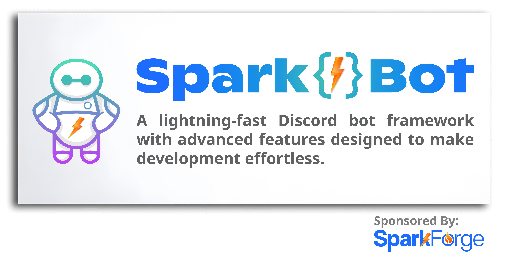

# Spark⚡️Bot

Spark⚡️Bot isn't just another Discord bot — it's a flexible and powerful development framework. By harnessing the reliability of the [discord.js](https://discordjs.dev/) library and the performance of the [Bun JavaScript toolkit](https://bun.sh/), Spark⚡️Bot unleashes a custom framework that propels you towards the creation of lightning-fast, powerhouse bots in record time.
